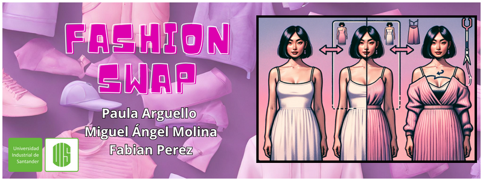

# FashionSwap: Image-Based Clothing Cropping for Style Transformation

  

${\textsf{\color{magenta}FashionSwap}}$ is an innovative AI project that focuses on the transformation of clothing styles. Using a dataset of individuals wearing different clothing items, the system segments or detects the clothing item, crops it, transfers its style through a GAN, and finally fits it back onto the individual. This way, we can visualize how a transformed clothing style would look on a person.

### Team Members
[Fabian Perez ](https://github.com/factral), [Paula Arguello ](https://github.com/paularguello07), [Miguel Molina ](https://github.com/MiguelAngMolina)

### Objective
Transform clothing into images of people by segmenting, cropping and transferring style using AI

### Datasets

We've utilized the following datasets in our project:

1. ${\textsf{\color{violet}Fashion Controlnet Dataset V3}}$ Another valuable dataset from HuggingFace which has been essential for our project.
   - [Access the dataset here](https://huggingface.co/datasets/Abrumu/Fashion_controlnet_dataset_V3?row=0)

2. ${\textsf{\color{violet}Texture Dataset}}$: Texture dataset made by hand, with a set of different types of textures

### Models
Neural style transfer and Unet

### Links
1. [Slides](https://www.canva.com/design/DAF1sMsvuTg/PbNxscZwtaf97Q3hyFmfxA/edit?utm_content=DAF1sMsvuTg&utm_campaign=designshare&utm_medium=link2&utm_source=sharebutton)
2. [Video](https://youtu.be/mSrIRElF3uI)
   
