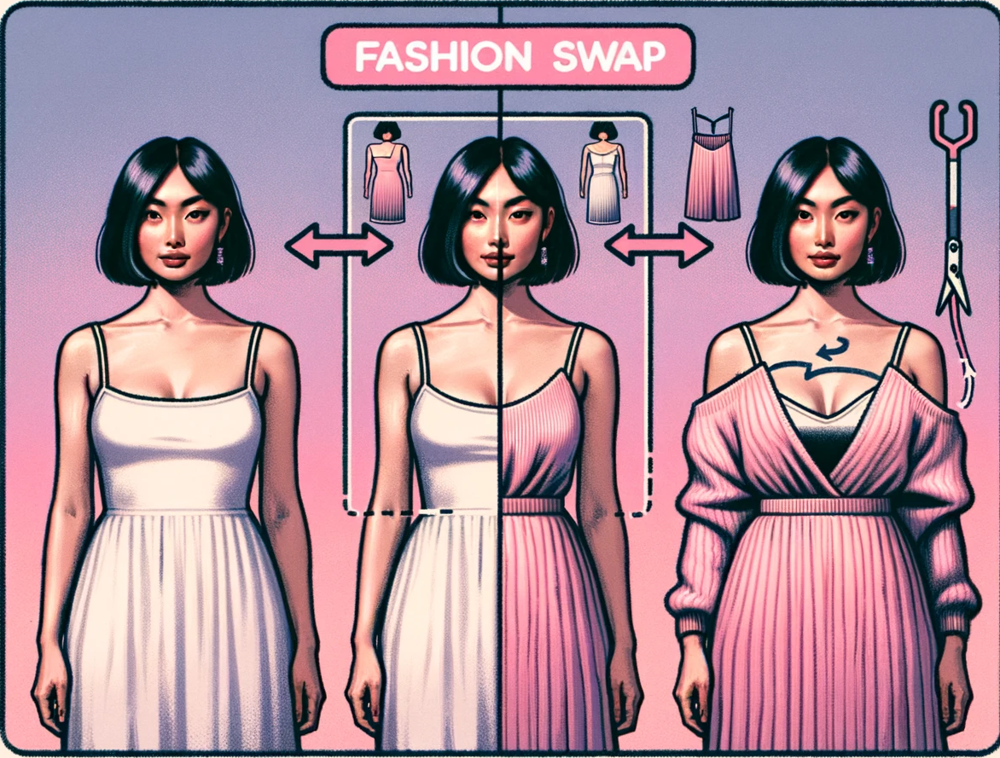

# FashionSwap: Image-Based Clothing Cropping for Style Transformation

  

${\textsf{\color{magenta}FashionSwap}}$ is an innovative AI project that focuses on the transformation of clothing styles. Using a dataset of individuals wearing different clothing items, the system segments or detects the clothing item, crops it, transfers its style through a GAN, and finally fits it back onto the individual. This way, we can visualize how a transformed clothing style would look on a person.

### Team Members
- [Fabian Perez ](https://github.com/factral)
- Paula Arguelo
- Miguel Angel

## Key Features

1. ${\textsf{\color{pink}Clothing Segmentation annd Cropping}}$ - Extract clothing from the background.
2. **${\textsf{\color{orchid}Style Transformation using GAN}}$** - Transfer the clothing style to generate a new one.
3. **${\textsf{\color{Apricot}Fitting the Transformed Clothing}}$** - Visualize how the new clothing style fits on a person.

### Datasets

We've utilized the following datasets in our project:

1. ${\textsf{\color{violet}Fashionpedia 4 Categories}}$: This dataset is available on HuggingFace and focuses on 4 main fashion categories. 
   - [Access the dataset here](https://huggingface.co/datasets/detection-datasets/fashionpedia_4_categories)
   
2. ${\textsf{\color{violet}Fashion Controlnet Dataset V3}}$ Another valuable dataset from HuggingFace which has been essential for our project.
   - [Access the dataset here](https://huggingface.co/datasets/Abrumu/Fashion_controlnet_dataset_V3?row=0)

